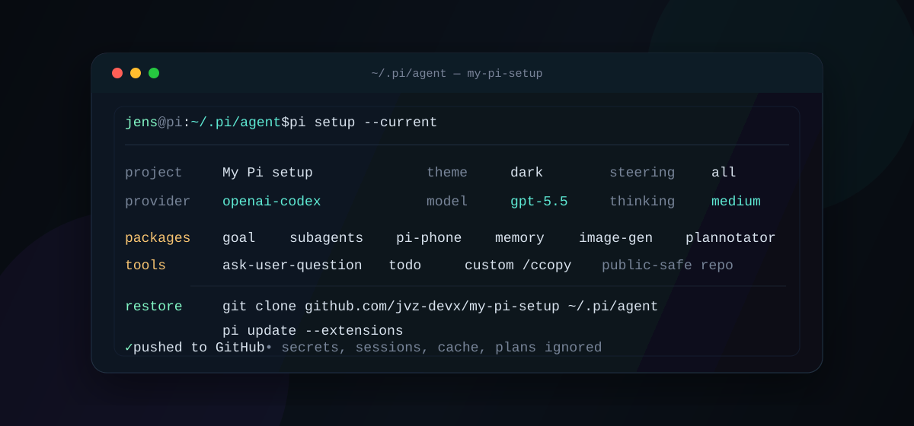

# My Pi setup



Personal, public-safe configuration for [`~/.pi/agent`](https://pi.dev/). This repo is intended to be easy to clone onto a new machine while keeping secrets, runtime state, generated cache files, and local-only data out of git.

## What's included

- `settings.json` — default provider/model, thinking level, theme, steering mode, and Pi packages.
- `extensions/copy.ts` — custom `/ccopy` command for copying an assistant response or selecting individual code blocks.
- `.env.example` — optional Pi Phone defaults with placeholder values only.
- `assets/readme-hero.svg` — README preview artwork.
- `git/.gitignore` — placeholder that keeps local/global git state directories available without tracking their contents.

## What's intentionally ignored

The repo keeps local machine state out of git:

- Secrets/auth: `.env`, `auth.json`, `models.json`, `*.key`, `*.pem`
- Runtime/cache: `sessions/`, `.pi/`, `node_modules/`, `.firecrawl/`
- Local skill symlinks: `skills/`
- Local planning notes: `PLAN.md`, `plans/`
- Logs and OS/editor noise

## Restore

```bash
git clone https://github.com/jvz-devx/my-pi-setup ~/.pi/agent
cd ~/.pi/agent
cp .env.example .env # optional; edit token before use
pi update --extensions
```

After restoring, sign in or recreate any local auth/runtime state through Pi rather than committing those files.

## Packages

`settings.json` installs the packages I want available by default:

- `@ramarivera/pi-goal`
- `@tintinweb/pi-subagents`
- `jvz-devx/pi-phone` from GitHub
- `@samfp/pi-memory`
- `pi-codex-image-gen`
- `@juicesharp/rpiv-ask-user-question`
- `@juicesharp/rpiv-todo`
- `@plannotator/pi-extension`

The Pi Phone package is pinned to my local-ahead fork:

```json
"git:https://github.com/jvz-devx/pi-phone@master"
```

## Custom commands

### `/ccopy [assistant-response-number]`

Claude-style copy helper for Pi. The `ccopy` name is intentional so it does not conflict with Pi's built-in copy command.

- Defaults to the most recent assistant response: `/ccopy`
- Select an older response: `/ccopy 2`, `/ccopy 3`, etc.
- In the UI, choose whether to copy the full response, write it to a file, copy a specific code block, or write a code block to a file.
- Falls back through common clipboard tools (`pbcopy`, `clip.exe`, `wl-copy`, `xclip`, `xsel`, `termux-clipboard-set`).

## Safety notes

Before pushing from a restored machine, run:

```bash
git status --short --ignored
```

Only intentional config/docs/source files should appear as untracked or modified. Secrets and runtime state should appear under ignored paths.
